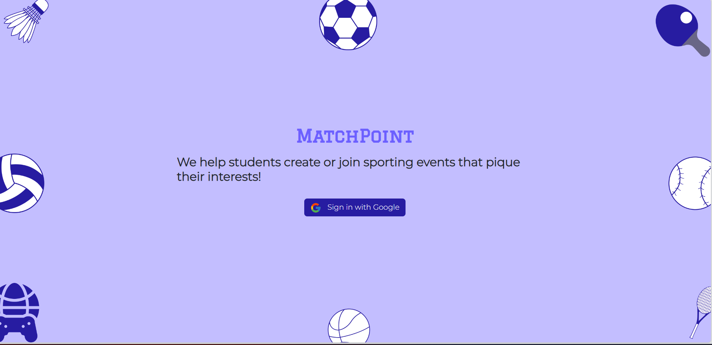

## MatchPoint

<!-- TABLE OF CONTENTS -->
<details>
  <summary>Table of Contents</summary>
  <ol>
    <li>
      <a href="#about-the-project">About The Project</a>
      <ul>
        <li><a href="#built-with">Built With</a></li>
      </ul>
    </li>

<li>
<a href="#demo">Demo</a>
</li>
    <li>
      <a href="#getting-started">Getting Started</a>
      <ul>
        <li><a href="#prerequisites">Prerequisites</a></li>
      </ul>
    </li>
    <li><a href="#usage">Usage</a></li>
    <li><a href="#known-bugs">Known Bugs</a></li>
    <li><a href="#contributing">Contributing</a></li>
    <li><a href="#contact">Developers</a></li>
    <li><a href="#acknowledgments">Acknowledgments</a></li>
  </ol>
</details>

<!-- ABOUT THE PROJECT -->

## About The Project



MatchPoint is built for students who want to organize and participate in pickup sports
games. It offers a variety of sports to choose from and allows users to join games based on their skill level. With this
app, students can discover games beyond their usual social circles and make new connections while having fun.

<p align="right">(<a href="#matchpoint">back to top</a>)</p>

### Built With

- [![React][react.js]][react-url]
- [![Bootstrap][bootstrap.com]][reactbootstrap-url]
- [![Firebase][firebase.js]][Firebase-url]

<p align="right">(<a href="#matchpoint">back to top</a>)</p>

<!-- GETTING STARTED -->

## Demo

Check out our app in action at:  https://matchpoint-2a22e.web.app!

To explore the app, you can sign in with your own Google account (we plan to add support for more sign-in methods in the
future). For security, we've **turned off write access** for the database, which means the users can't create or join
events. If you want
to explore these features, please contact us.

Note that this app was developed in a short timeframe of 3 weeks and may still contain some bugs. If you encounter any
issues, please feel free to report them in the Issues section of our GitHub repository.

## Getting Started

The following section outlines the steps for building and running MatchPoint. Firstly, clone the repository to your
local
directory.

### Prerequisites

It is important to note that this project requires Node Package Manager (npm) to be installed on your system. If you do
not have it installed, you can follow the following commands:

- To download the latest version of npm, on the command line, run the following command
  ```sh
  npm install
  ```

- To see if you already have Node.js and npm installed and check the installed version, run the following commands:
  ```sh
  node -v
  npm -v
  ```

Refer to this link for detailed installation
instructions: <a href="https://docs.npmjs.com/downloading-and-installing-node-js-and-npm">Downloading and installing
Node.js and npm</a>.

After installing Node.js and Npm, you need to set up a firbase account following this
tutorial: <a href="https://cloud.google.com/firestore/docs/client/get-firebase">Getting started with Firebase</a>

* Log into your Firebase Account on the command line
  ```
  firebase login
  ```

* Now that you’re logged in, you will need to initialize Firebase in your React app
  ```
  firebase init
  ```

For help configuring Firebase, check out this useful
tutorial: <a href="[https://cloud.google.com/firestore/docs/client/get-firebase](https://medium.com/swlh/how-to-deploy-a-react-app-with-firebase-hosting-98063c5bf425)">
How to Deploy a React App with Firebase Hosting
</a>

Once you have npm and firebase CLI installed, you can start running the project.

### Run

To run the project, execute the following command:

- npm
  ```sh
  npm run
  ```

Upon running the command, you will be prompted with a localhost URL, which can be opened in any browser to access the
project.

<!-- USAGE EXAMPLES -->

## Usage

Once users sign in, they can access the main page where a list of posted events is displayed. They can easily join any
event that still has open spots available.

Users can also create their own events with the click of a button. As the event owner, they have the ability to edit or
delete the event if needed.

As event participants, users will receive relevant notifications, such as when a new participant joins the event or if
the event is cancelled. These notifications keep everyone in the loop and ensure that participants are always up-to-date
with the latest event details.

<p align="right">(<a href="#matchpoint">back to top</a>)</p>

<!-- ROADMAP -->

## Roadmap

A few features we'd love to add in the future:

- [ ] Create teams and join events as a team
- [ ] "Favorite" events or save for later
- [ ] Share events with people outside of MatchPoint
- [ ] Message event organizer and participants
- [ ] Event filtering (tags, full/open events)

<p align="right">(<a href="#matchpoint">back to top</a>)</p>

## Known Bugs

- N/A

<!-- CONTRIBUTING -->

## Contributing

Contributions are what make the open source community such an amazing place to learn, inspire, and create. Any
contributions you make are **greatly appreciated**.

If you have a suggestion that would make this better, please fork the repo and create a pull request. You can also
simply open an issue with the tag "enhancement".
Don't forget to give the project a star! Thanks again!

1. Fork the Project
2. Create your Feature Branch (`git checkout -b feature/AmazingFeature`)
3. Commit your Changes (`git commit -m 'Add some AmazingFeature'`)
4. Push to the Branch (`git push origin feature/AmazingFeature`)
5. Open a Pull Request

<p align="right">(<a href="#matchpoint">back to top</a>)</p>


<!-- CONTACT -->

## Developers

Finley Li, Vedant Apte, Rawan Mohamed, Hongle Che, Shiyuan Duan, Elina Rawat, Evan Waite, Vincent Wei


<p align="right">(<a href="#matchpoint">back to top</a>)</p>

<!-- ACKNOWLEDGMENTS -->

## Acknowledgments

A special shoutout to the following resources/libraries that have been instrumental in the development of this project:

- [React Bootstrap](https://react-bootstrap.github.io/)
- [Font Awesome](https://fontawesome.com)

<p align="right">(<a href="#matchpoint">back to top</a>)</p>

<!-- MARKDOWN LINKS & IMAGES -->
<!-- https://www.markdownguide.org/basic-syntax/#reference-style-links -->

[contributors-shield]: https://img.shields.io/github/contributors/othneildrew/Best-README-Template.svg?style=for-the-badge

[contributors-url]: https://github.com/othneildrew/Best-README-Template/graphs/contributors

[forks-shield]: https://img.shields.io/github/forks/othneildrew/Best-README-Template.svg?style=for-the-badge

[forks-url]: https://github.com/othneildrew/Best-README-Template/network/members

[stars-shield]: https://img.shields.io/github/stars/othneildrew/Best-README-Template.svg?style=for-the-badge

[stars-url]: https://github.com/othneildrew/Best-README-Template/stargazers

[issues-shield]: https://img.shields.io/github/issues/othneildrew/Best-README-Template.svg?style=for-the-badge

[issues-url]: https://github.com/othneildrew/Best-README-Template/issues

[license-shield]: https://img.shields.io/github/license/othneildrew/Best-README-Template.svg?style=for-the-badge

[license-url]: https://github.com/othneildrew/Best-README-Template/blob/master/LICENSE.txt

[linkedin-shield]: https://img.shields.io/badge/-LinkedIn-black.svg?style=for-the-badge&logo=linkedin&colorB=555

[linkedin-url]: https://linkedin.com/in/othneildrew

[product-screenshot]: images/screenshot.png

[next.js]: https://img.shields.io/badge/next.js-000000?style=for-the-badge&logo=nextdotjs&logoColor=white

[next-url]: https://nextjs.org/

[react.js]: https://img.shields.io/badge/React-20232A?style=for-the-badge&logo=react&logoColor=61DAFB

[react-url]: https://reactjs.org/

[mantine-url]: https://mantine.dev/

[mantine.js]: https://img.shields.io/badge/-Mantine-blue

[vue.js]: https://img.shields.io/badge/Vue.js-35495E?style=for-the-badge&logo=vuedotjs&logoColor=4FC08D

[vue-url]: https://vuejs.org/

[angular.io]: https://img.shields.io/badge/Angular-DD0031?style=for-the-badge&logo=angular&logoColor=white

[angular-url]: https://angular.io/

[svelte.dev]: https://img.shields.io/badge/Svelte-4A4A55?style=for-the-badge&logo=svelte&logoColor=FF3E00

[svelte-url]: https://svelte.dev/

[laravel.com]: https://img.shields.io/badge/Laravel-FF2D20?style=for-the-badge&logo=laravel&logoColor=white

[laravel-url]: https://laravel.com

[bootstrap.com]: https://img.shields.io/badge/Bootstrap-563D7C?style=for-the-badge&logo=bootstrap&logoColor=white

[bootstrap-url]: https://getbootstrap.com

[jquery.com]: https://img.shields.io/badge/jQuery-0769AD?style=for-the-badge&logo=jquery&logoColor=white

[jquery-url]: https://jquery.com

[firebase.js]: https://img.shields.io/badge/-Firebase-red

[firebase-url]: https://firebase.google.com/?gclid=Cj0KCQjwk7ugBhDIARIsAGuvgPaXztBG1WOHMVisbV3i18VWTbtCzTxjGAoxienTAk6auK9SXV35mzgaAsCdEALw_wcB&gclsrc=aw.ds

[reactbootstrap.com]:https://www.google.com/url?sa=i&url=https%3A%2F%2Fwww.cleanpng.com%2Fpng-bootstrap-react-software-framework-javascript-fron-2706377%2F&psig=AOvVaw1aTVKJL-LDOwhVUL8Bt8RX&ust=1679547773500000&source=images&cd=vfe&ved=0CA8QjRxqFwoTCNig2YLh7v0CFQAAAAAdAAAAABAI

[reactbootstrap-url]:https://react-bootstrap.github.io/
